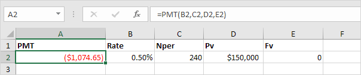

# Lab 06 - Amortization Schedule Part 1

_Learning Objectives: Demonstrate understanding of for loops. Demonstrate use of formatted output._ 

Most of us have encountered or will encounter in the future the desision of taking out a loan. The actual calculation of monthly payment, interest, and principle amounts can be tricky! Different types of loans have different ways of calculating the monthly payments and what amount goes toward interest as opposed to the principle.  The most challenging loan to do these calculations for is an amortized loan. When someone takes out an amortized loan they are usually given an amortization schedule that displays the payment number, monthly payment amount, interest portion of each monthly payment along with the amount that goes towards principle, and the remaining balance after each monthly payment. 

Check out the following websites for more information on amortization:

- [Amortization in Wikipedia](https://en.wikipedia.org/wiki/Amortization_(business))

- [Amortization in Investopedia](https://www.investopedia.com/terms/a/amortization.asp)

## Step 1: Create a function that calculates and displays the amortization schedule ##
Write a function called *create_schedule* that takes three parameters; principle, monthly interest rate, and term (in years).  The function should calculate the following:

- monthly payment
- interest payment each month
- principle payment each month
- remaining balance after payment

Think of how all of the components interact with each other. 

Here is the formula for the monthly payment:

where A is the payment, P is the principle, r is the monthly rate, and n is the total number of payments (i.e. 12 times the term).

Your function should return a string of the entire formatted table. *Hint: use concatenation, +, to add to your string each iteration.*

There is a way to check your monthly payment amount by using the PMT function in Excel which calculates a monthly payment for a loan based on constant payments and a constant interest rate. 
_ =PMT(monthly rate, total number of payments, total loan amount, 0). _

In order for our schedule to make sense, we will need to use a loop to display the data for each payment.

For your schedule output please use the exact format displayed below:

    Payment Number      Payment          Interest         Principle          Balance
           1       ($    438.71)     ($     41.67)     ($    397.05)     $  9,602.95
           2       ($    438.71)     ($     40.01)     ($    398.70)     $  9,204.25
 
** NOTE ** : the number of payments should be equal to the total number of payments for the entire loan period. 

## Step 2: Set up the main function
Create an intoductory message for the user. 
Assign appropriate values for loan, rate, and term variables then invoke the *create_schedule* function and display the resulting table to the console. 

Congratulations, you are now more aware of how amortization schedules work!

## Test ## 
Try out your function with different values to check that it is working correctly. 
There is one unit test created for you to test your schedule function output.  
Be sure to use the formatting capabilities that python allows for string formating. 

Spaces, alignment, and other characters matter (use the output example above as a guide).

## Submit ##
There are automated tests for this lab so make sure they pass before submitting.  As always, stop by student hours, send an email, check in with a peer, or stop by the STEM Center if you need any assistance.